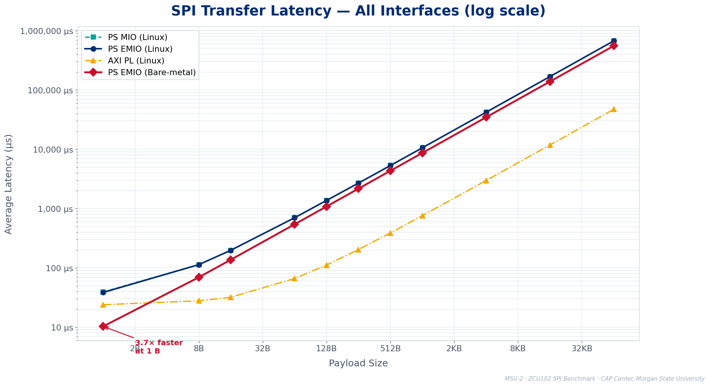
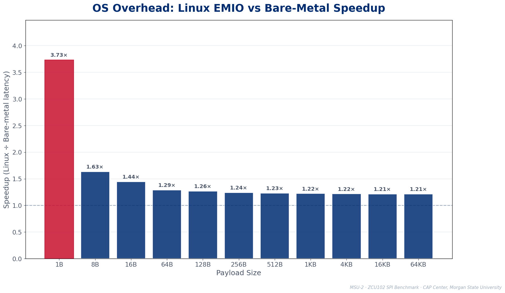
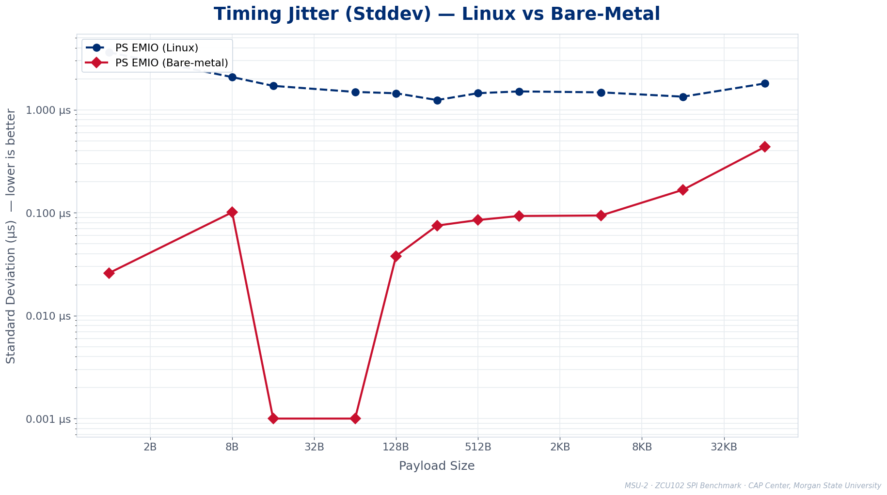
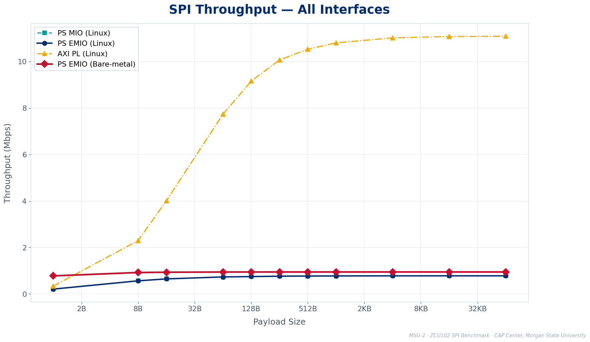

# ZCU102 SPI Benchmark — MSU-2

**Exploring System-on-Chip Architectures**  
Cybersecurity Assurance & Policy (CAP) Center, Morgan State University  
Sponsored by Booz Allen Hamilton / Laboratory for Physical Science (LPS/ACS)

---

## What This Is

A rigorous, silicon-validated characterization of SPI communication performance on the Xilinx ZCU102 (Zynq UltraScale+ MPSoC), comparing four interfaces across two execution environments:

| Interface | Controller | Environment |
|-----------|-----------|-------------|
| PS MIO | Hard PS SPI0 (Cadence) | Linux (cadence_spi driver) |
| PS EMIO | Hard PS SPI1 (Cadence) | Linux (cadence_spi driver) |
| AXI PL | Soft AXI Quad SPI v3.2 | Linux (xilinx_spi driver) |
| PS BM | Hard PS SPI1 (Cadence) | Bare-metal (no OS, XSpiPs) |

All PS paths run at a matched clock of **~0.9766 MHz SCK** for a controlled comparison. AXI runs at its synthesis-time rate (~6.25 MHz effective SCK at PL0=250 MHz / C_SCK_RATIO=16).

---

## Key Results

### OS Overhead — Fixed Cost Per Transfer (~28 µs)

The Linux kernel SPI stack adds a roughly **fixed ~28 µs overhead per transfer**, regardless of payload size. This produces a characteristic speedup curve:

| Payload | Bare-metal (µs) | Linux EMIO (µs) | Speedup |
|---------|----------------|-----------------|---------|
| 1 B | 10.3 | 38.5 | **3.73×** |
| 64 B | 543.3 | 700.8 | 1.29× |
| 1,024 B | 8,669.2 | 10,577.9 | 1.22× |
| 65,536 B | 554,744.8 | 673,310.5 | 1.21× |

**Design guidance:** If your workload is many small SPI transactions, bare-metal wins big. For bulk transfers, the OS convenience costs only ~21% overhead.

### Determinism — Bare-Metal is Dramatically Steadier

| | Bare-metal | Linux EMIO |
|--|-----------|------------|
| Best jitter | **1 ns** (16 B, 64 B) | 1.2 µs |
| Worst jitter | **436 ns** (65,536 B) | 3.6 µs |
| All payloads | **< 0.5 µs** | 1.2–3.6 µs |

Bare-metal jitter is sub-microsecond at every payload size. Critical for real-time and security-critical embedded systems.

---

## Charts

All charts are 16:9 at 1920×1080, generated from real silicon data.

### Latency — All Interfaces (log scale)


### OS Overhead Speedup by Payload


### Jitter: Linux vs Bare-Metal


### Throughput — All Interfaces


---

## Repository Structure

```
spi-soc-research/
├── bare_metal/
│   ├── src/spi_benchmark_bare_zynqmp.c   # Bare-metal benchmark (XSpiPs)
│   ├── HANDOFF_baremetal_capture.md       # Full debug arc + capture notes
│   └── PLAIN_ENGLISH_RECAP.md             # Plain-language summary
├── docs/
│   ├── findings/month1_progress.md        # Month 1 progress report
│   └── notes/                             # Research plan, design notes
├── hardware/
│   ├── xsa/spi_benchmark_wrapper.xsa      # Vivado hardware export
│   ├── spi_bm_bd.tcl                      # Block design script
│   └── zcu102_spi_benchmark.xdc           # Pin constraints
├── linux/
│   ├── src/spi_benchmark.c                # Linux benchmark (spidev ioctls)
│   ├── src/spi_benchmark_jitter.c         # Jitter harness (CLOCK_MONOTONIC_RAW)
│   ├── src/spi_benchmark_jitter_aarch64   # Pre-built aarch64 binary
│   ├── petalinux/device-tree/             # Device tree overlays
│   └── JITTER_CAPTURE_RESUME.md           # Boot/capture session notes
├── results/
│   ├── mio_results.csv                    # PS MIO latency + real stddev
│   ├── emio_results.csv                   # PS EMIO latency + real stddev
│   ├── axi_results.csv                    # AXI PL latency + stddev
│   ├── baremetal_results.csv              # Bare-metal latency + real stddev
│   ├── emio_internal_results.csv          # Full jitter capture (min/max/avg/stddev)
│   ├── compare_spi.py                     # 4-way comparison + integrity checks
│   ├── plot_spi_comparison.py             # Chart generator (run to regenerate PNGs)
│   └── charts/                            # Generated PNG charts (16:9, slides-ready)
├── scripts/
│   ├── DEPLOY_AND_TEST.md                 # Board init sequence
│   └── rebuild_bitstream.tcl              # Vivado bitstream rebuild
└── sd-images/
    ├── BOOT.BIN                           # Original Linux boot image
    ├── BOOT_linux_rebuild.bin             # Reproducible rebuild (see linux_rebuild.bif)
    ├── linux_rebuild.bif                  # Bootgen recipe for BOOT_linux_rebuild.bin
    ├── BOOT_linux_rebuild.md              # Build record with md5 provenance
    ├── image.ub                           # PetaLinux kernel + ramdisk (spidev-enabled)
    ├── baremetal/BOOT_baremetal.bin       # Silicon-proven bare-metal boot image
    └── spi_benchmark_wrapper.bit.bin      # FPGA bitstream (AXI SPI controller)
```

---

## Reproducing Results

### Board Setup

**Hardware:** Xilinx ZCU102 evaluation board  
**SW6 (boot mode):** `0010` — switch 3 ON, all others OFF (SD boot)  
**Serial console:** `jeremiahc:/dev/ttyUSB0` at 115200 baud (Silicon Labs CP2108)  
**JTAG:** `stile` via Digilent FT232H  

### Boot Linux

Flash `sd-images/BOOT_linux_rebuild.bin` as `BOOT.BIN` on the SD card, along with `image.ub`, `boot.scr`, `system.dtb`. Login: `petalinux` / set on first boot.

### Board Init Sequence (run as root after every boot)

```bash
# Load FPGA bitstream
mkdir -p /usr/lib/firmware
cp /run/media/BOOT-mmcblk0p1/spi_benchmark_wrapper.bit.bin /usr/lib/firmware/
echo spi_benchmark_wrapper.bit.bin > /sys/class/fpga_manager/fpga0/firmware

# Apply device tree overlay (extract from image.ub — do NOT use /boot/devicetree/pl.dtbo)
dumpimage -T flat_dt -p 2 -o /tmp/spi_pl.dtbo /run/media/BOOT-mmcblk0p1/image.ub
mkdir -p /sys/kernel/config/device-tree/overlays/spi-benchmark
cat /tmp/spi_pl.dtbo > /sys/kernel/config/device-tree/overlays/spi-benchmark/dtbo

# Verify
cat /sys/class/fpga_manager/fpga0/state          # should print: operating
cat /sys/kernel/config/device-tree/overlays/spi-benchmark/status  # should print: applied
ls /dev/spidev*                                   # should show: /dev/spidev1.0

# Symlink for harness (hardcoded to spidev0.0)
ln -sf /dev/spidev1.0 /dev/spidev0.0
```

### Run Linux Jitter Benchmark

```bash
# Copy binary to board (via SD card or scp)
chmod +x spi_benchmark_jitter_aarch64
./spi_benchmark_jitter_aarch64   # must run as root
# Output written to /tmp/emio_internal_results.csv
```

### Run Bare-Metal Benchmark

Flash `sd-images/baremetal/BOOT_baremetal.bin` as `BOOT.BIN`. Board boots directly into the benchmark, prints results table over UART at 115200, then idles. Results also readable via JTAG (`mrd 0x10e178 88`).

### Regenerate Charts

```bash
cd results
python3 plot_spi_comparison.py --dir . --out ./charts
```

Requires `matplotlib` and `numpy` (`pip3 install matplotlib numpy`).

### Run Comparison Script

```bash
cd results
python3 compare_spi.py --dir . --no-plot --sck-ps 976600
# Expected: "No integrity flags raised."
```

---

## Hardware Design Notes

### Two Controller Types

**PS SPI (MIO / EMIO)** — hard silicon in the Processing System. Enabled and routed; clock changeable at runtime via prescaler register. Linux driver: `cadence_spi`.

**AXI Quad SPI (PL)** — soft IP in the FPGA fabric. Clock divider (`C_SCK_RATIO=16`) is frozen at synthesis time; changing speed requires a full bitstream rebuild. Linux driver: `xilinx_spi`. Four separate bitstreams exist for 1/12/25/50 MHz operation.

### The Clock Artifact (Important)

An early result showed AXI running **14× faster** than PS — this was not a real performance difference. The AXI fabric clock (`PL0`) was running at **250 MHz** (not the documented 100 MHz), making AXI's effective SCK ~15.6 MHz vs PS's ~0.98 MHz. At matched clock speeds, the advantage disappears. **Rule: always read clock speed from the live chip (`CRL_APB` registers), never trust config files.**

### Single-Clock AXI Coupling

Both `ext_spi_clk` and `s_axi_aclk` are tied to the same `PL0` clock. This means lowering PL0 to match the PS serial clock also slows the FIFO-service path — there is no separate fast AXI bus clock domain.

---

## Citation / Contact

**Project:** MSU-2 — Exploring System-on-Chip Architectures  
**PI:** Dr. Kevin Kornegay, Eugene DeLoatch Endowed Professor in Cybersecurity Engineering  
**Lab:** Cybersecurity Assurance & Policy (CAP) Center, Morgan State University  
**Sponsor:** Booz Allen Hamilton / LPS Advanced Computing Systems Division  
**Period:** 2025–2026  
